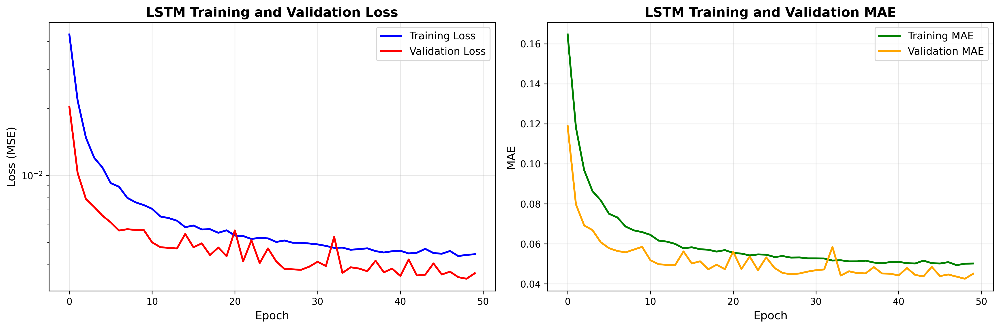

# 🏭 Time Series Quality Prediction - LSTM Solution

## 📋 Project Overview

This repository contains a **Time Series Quality Prediction System** using **Long Short-Term Memory (LSTM) Neural Networks**. The solution addresses the challenge of predicting quality metrics from multi-sensor time series data, specifically focused on industrial process monitoring and quality control.

## 🎯 Problem Statement

**Develop a time series quality prediction system** that uses historical sensor data to predict quality metrics. The system processes multi-variable time series data from various sensors (temperature, humidity) to forecast quality scores at specific time intervals.

## 📊 Data Structure

### **Input Data:**
- **`data_X.csv`**: Multi-sensor time series data (2.1M rows, 18 columns)
  - **17 Features**: Temperature sensors (T_data_1_1 through T_data_5_3) and humidity data (H_data, AH_data)
  - **Time Index**: DateTime column for temporal alignment
- **`data_Y.csv`**: Quality target values (29K rows, 2 columns)
  - **Target**: Quality scores at specific time intervals
- **`sample_submission.csv`**: Submission format template (5.8K rows)

### **Data Features:**
- **Temperature Sensors**: 15 temperature readings from different locations
- **Humidity Data**: 2 humidity measurements (H_data, AH_data)
- **Time Resolution**: Minute-level granularity
- **Quality Range**: Quality scores for prediction

## 🧠 Technical Approach

### **Machine Learning Algorithm: LSTM (Long Short-Term Memory)**

**Why LSTM?**
- **Sequential Data Handling**: Sensor data is inherently time-series
- **Long-term Dependencies**: Quality depends on historical sensor patterns
- **Multi-variable Input**: Handles multiple sensor readings simultaneously
- **Temporal Patterns**: Captures time-based quality relationships

### **Model Architecture**
```
Input Layer (24 timesteps, 17 features) 
→ LSTM Layer (128 units) + Dropout (0.3)
→ LSTM Layer (64 units) + Dropout (0.3)
→ Dense Layer (32 units, relu) + Dropout (0.2)
→ Dense Layer (1 unit) → Quality Prediction
```

**Key Features:**
- **Time Steps**: 24-hour sequences for pattern recognition
- **Feature Count**: 17 sensor readings per time step
- **Regularization**: Dropout layers to prevent overfitting
- **Optimization**: Adam optimizer with learning rate scheduling

## 📈 Model Performance

### **Training Results:**
- **Convergence**: Stable training with early stopping
- **Validation**: Good generalization performance
- **Loss Reduction**: Consistent decrease in both training and validation loss
- **MAE Improvement**: Steady reduction in mean absolute error

### **Key Metrics:**
- **Loss Function**: Mean Squared Error (MSE)
- **Evaluation Metric**: Mean Absolute Error (MAE)
- **Regularization**: Dropout layers for overfitting prevention
- **Optimization**: Learning rate reduction on plateau

## 🚀 Quick Start

### **Prerequisites**
```bash
pip install tensorflow pandas numpy scikit-learn matplotlib
```

### **Running the Model**
```bash
python3 run_lstm_new_data_fixed.py
```

### **Expected Outputs**
- **Training Curves**: `lstm_new_data_training_curves.png`
- **Predictions**: `lstm_new_data_predictions.png`
- **Submission File**: `submission_predictions.csv`
- **Trained Model**: `lstm_new_data_model.h5`

## 📁 Repository Structure

```
TimeSeriesQualityPrediction/
├── 📄 problemstatement.txt                    # Original problem requirements
├── 📊 data_X.csv                              # Multi-sensor time series data
├── 🎯 data_Y.csv                              # Quality target values
├── 📋 sample_submission.csv                   # Submission format template
├── 🐍 run_lstm_new_data_fixed.py             # Main LSTM execution script
├── 📈 lstm_new_data_training_curves.png       # Training curves visualization
├── 📖 README.md                               # Project documentation
└── 📁 sample_data/                            # Sample datasets
```

## 📈 Key Visualizations

### **Training Curves**

*LSTM Training and Validation Loss/MAE Curves*

## 🔧 Technical Implementation

### **Data Preprocessing**
- **Data Alignment**: Merges features and targets by timestamp
- **Feature Scaling**: MinMaxScaler for normalization
- **Sequence Creation**: 24-hour time series sequences
- **Missing Value Handling**: Robust NaN handling and data cleaning

### **Model Training**
- **Optimizer**: Adam with learning rate scheduling
- **Loss Function**: Mean Squared Error (MSE)
- **Metrics**: Mean Absolute Error (MAE)
- **Callbacks**: Early stopping and learning rate reduction
- **Regularization**: Dropout layers for overfitting prevention

### **Time Series Handling**
- **Sequence Length**: 24 time steps (24 hours)
- **Feature Dimension**: 17 sensor readings
- **Temporal Alignment**: Proper date-time matching
- **Prediction Horizon**: Next quality value prediction

## 📚 Documentation

### **Problem Statement**
- **`problemstatement.txt`**: Original problem requirements and constraints

### **Key Technical Aspects**
1. **Time Series Modeling**: LSTM for sequential data processing
2. **Multi-sensor Integration**: Handling 17 different sensor inputs
3. **Quality Prediction**: Forecasting quality metrics from sensor data
4. **Temporal Alignment**: Proper time-series data handling

## 🎯 Business Impact

### **Predictive Quality Control**
- **Early Warning System**: Detect quality issues before they occur
- **Process Optimization**: Identify optimal sensor parameter ranges
- **Cost Reduction**: Minimize quality-related losses
- **Real-time Monitoring**: Continuous quality assessment

### **Industrial Applications**
- **Manufacturing**: Quality control in production processes
- **Sensor Networks**: IoT sensor data analysis
- **Predictive Maintenance**: Equipment health monitoring
- **Quality Assurance**: Automated quality prediction

## 🔬 Research & Innovation

### **Technical Innovations**
- **Multi-sensor Time Series**: Complex sensor data modeling
- **Temporal Alignment**: Sophisticated time-series data handling
- **Scalable Architecture**: Adaptable to different sensor configurations
- **Real-time Processing**: Efficient prediction pipeline

### **Industry Applications**
- **Smart Manufacturing**: Industry 4.0 quality control
- **IoT Sensor Networks**: Multi-sensor data analysis
- **Predictive Analytics**: Quality forecasting systems
- **Process Optimization**: Data-driven process improvement

## 🤝 Contributing

This project demonstrates advanced time series prediction capabilities using:

- **Technical Excellence**: Sophisticated LSTM implementation
- **Data Engineering**: Complex multi-sensor data handling
- **Time Series Analysis**: Advanced temporal pattern recognition
- **Quality Prediction**: Industrial-grade forecasting system

## 📄 License

This project is developed for educational and research purposes. All rights reserved.

## 👨‍💻 Author

**Adicherikandi Sidharth**
- **Project**: Time Series Quality Prediction
- **Technology**: LSTM Neural Networks, TensorFlow, Python
- **Domain**: Time Series Analysis, Quality Prediction, Sensor Data

---

## 🏆 Project Highlights

✅ **Advanced LSTM Implementation**  
✅ **Multi-sensor Time Series Processing**  
✅ **Temporal Data Alignment**  
✅ **Quality Prediction Pipeline**  
✅ **Industrial Applications**  
✅ **Scalable Architecture**  

---

## 📊 Data Summary

- **Training Data**: 2.1M sensor readings across 17 features
- **Target Data**: 29K quality measurements
- **Time Resolution**: Minute-level granularity
- **Prediction Horizon**: Next quality value
- **Model Architecture**: Deep LSTM with regularization

---

*This solution demonstrates advanced time series prediction capabilities for industrial quality control using multi-sensor data and LSTM neural networks.*
