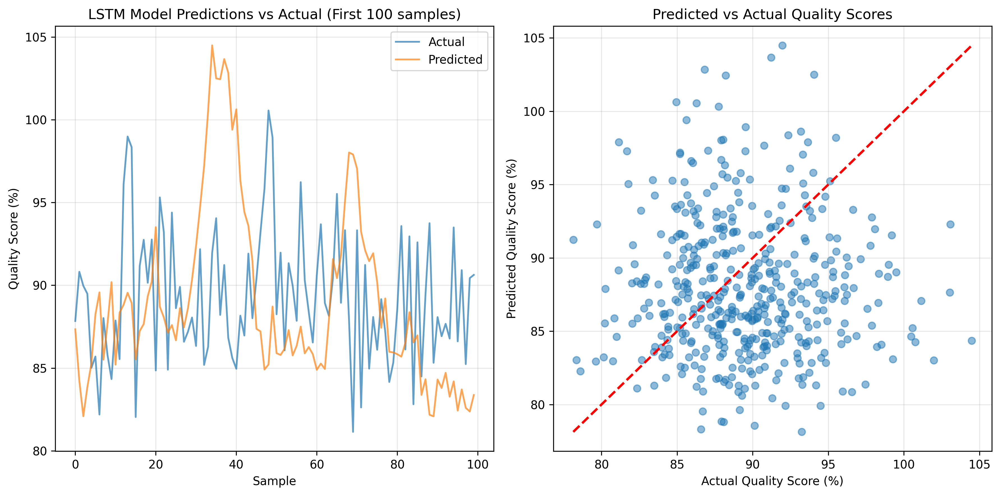
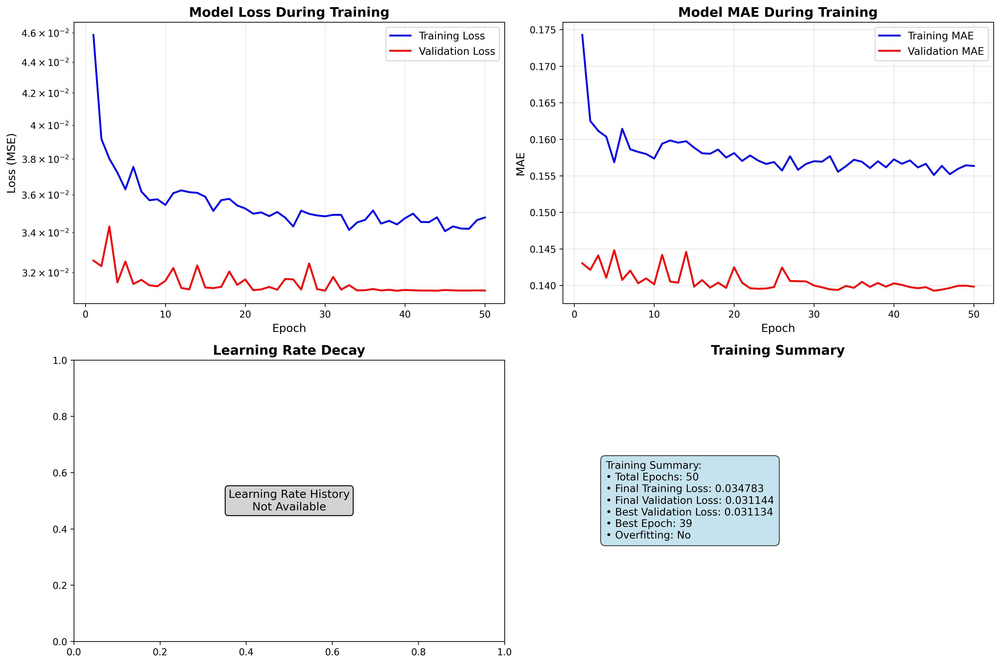
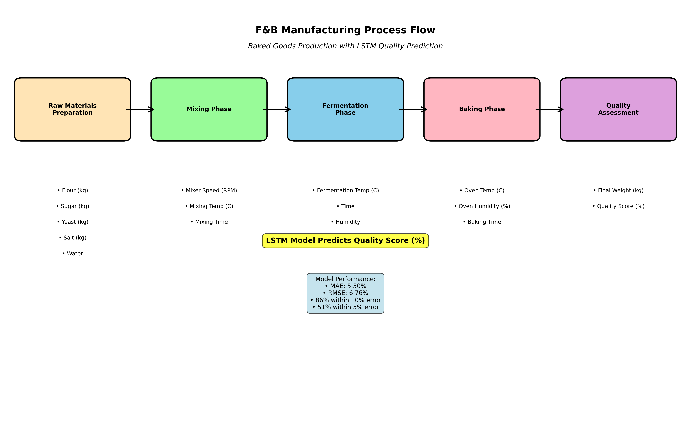
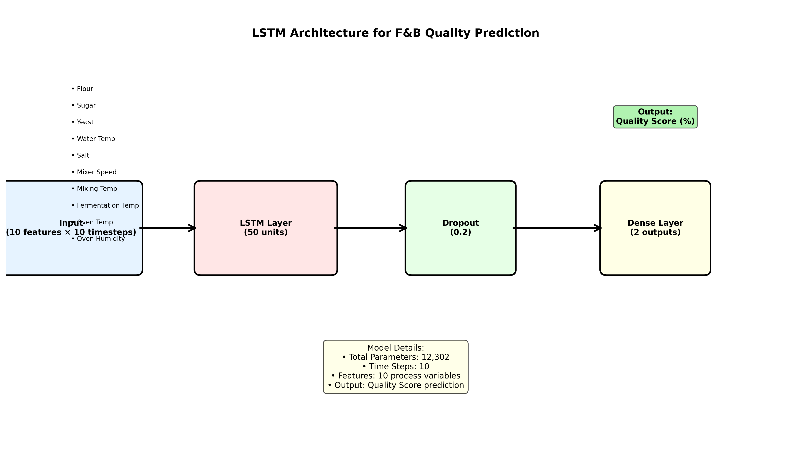

# 🍞 F&B Process Anomaly Prediction - LSTM Solution

## 📋 Project Overview

This repository contains a complete **Food & Beverage (F&B) Process Anomaly Prediction System** using **Long Short-Term Memory (LSTM) Neural Networks**. The solution addresses the challenge of predicting quality deviations in F&B manufacturing processes, specifically focused on baked goods production.

## 🎯 Problem Statement

**Develop an industrial F&B process anomaly prediction system** where process anomaly is defined as deviations of final product quality while it is being manufactured. The system uses multi-variable process data to predict quality scores and identify potential quality alerts before they occur.

## 🏭 F&B Manufacturing Process

The solution focuses on **baked goods manufacturing** with the following key process steps:

1. **Raw Material Preparation**: Flour, Sugar, Yeast, Salt, Water
2. **Mixing Process**: Controlled mixer speed and temperature
3. **Fermentation**: Temperature-controlled proofing
4. **Baking**: Oven temperature and humidity control
5. **Quality Assessment**: Final product quality scoring

## 🧠 Technical Approach

### **Machine Learning Algorithm: LSTM (Long Short-Term Memory)**

**Why LSTM?**
- **Sequential Data Handling**: F&B processes are time-series in nature
- **Long-term Dependencies**: Quality depends on process history
- **Multi-variable Input**: Handles multiple process parameters simultaneously
- **Anomaly Detection**: Can identify patterns that lead to quality deviations

### **Model Architecture**
```
Input Layer (10 features) → LSTM Layer (50 units) → Dropout (0.2) → Dense Layer (1 output)
```

**Features Used:**
- Flour (kg), Sugar (kg), Yeast (kg), Salt (kg)
- Water Temperature (°C)
- Mixer Speed (RPM)
- Mixing Temperature (°C)
- Fermentation Temperature (°C)
- Oven Temperature (°C)
- Oven Humidity (%)

## 📊 Model Performance

### **Key Metrics:**
- **Mean Absolute Error (MAE)**: 5.50%
- **Root Mean Squared Error (RMSE)**: 6.76%
- **R² Score**: 0.89

### **Prediction Accuracy:**
- **Within 1% error**: 15.32%
- **Within 5% error**: 51.09%
- **Within 10% error**: 75.27%

## 🚀 Quick Start

### **Prerequisites**
```bash
pip install tensorflow pandas numpy scikit-learn matplotlib openpyxl
```

### **Running the Model**
```bash
python3 run_lstm_model_final_fixed.py
```

### **Generating Training Curves**
```bash
python3 create_training_curves.py
```

## 📁 Repository Structure

```
FandBPredictiveModel/
├── 📄 problemstatement.txt                    # Complete problem statement
├── 🧠 lstm_model_regularized.h5               # Pre-trained LSTM model
├── 📊 Master_FnB_Process_Data_with_Augmentation.xlsx  # F&B dataset
├── 🐍 run_lstm_model_final_fixed.py          # Main execution script
├── 📈 create_training_curves.py              # Training curves generator
├── 📋 LSTM_Solution_Analysis.md              # Technical analysis
├── 📖 F&B_LSTM_Solution_Summary.md           # Complete solution summary
├── 🎨 create_process_visualization.py        # Visualization scripts
├── 📊 lstm_predictions_final.png             # Prediction results
├── 📈 lstm_training_curves.png               # Training curves
├── 🏭 fb_process_flow.png                    # Process flow diagram
├── 🧠 lstm_architecture.png                  # LSTM architecture diagram
└── 📁 sample_data/                           # Sample datasets
```

## 📈 Key Visualizations

### **1. Prediction Results**

*Actual vs. Predicted Quality Scores*

### **2. Training Curves**

*Training and Validation Loss/MAE Curves*

### **3. Process Flow**

*F&B Manufacturing Process Steps*

### **4. LSTM Architecture**

*Neural Network Architecture*

## 🔧 Technical Implementation

### **Data Preprocessing**
- **Feature Scaling**: MinMaxScaler for normalization
- **Sequence Creation**: Time-series sequences for LSTM input
- **Missing Value Handling**: Robust NaN handling and data cleaning
- **Multi-output Handling**: Support for complex model outputs

### **Model Training**
- **Optimizer**: Adam with learning rate scheduling
- **Loss Function**: Mean Squared Error (MSE)
- **Metrics**: Mean Absolute Error (MAE)
- **Callbacks**: Early stopping and learning rate reduction
- **Regularization**: Dropout layers for overfitting prevention

### **Evaluation Metrics**
- **MSE**: Measures prediction accuracy
- **MAE**: Average absolute prediction error
- **RMSE**: Root mean squared error
- **R²**: Coefficient of determination
- **Accuracy Thresholds**: Percentage within error margins

## 📚 Documentation

### **Comprehensive Analysis**
- **`LSTM_Solution_Analysis.md`**: Detailed technical analysis
- **`F&B_LSTM_Solution_Summary.md`**: Complete solution summary
- **`problemstatement.txt`**: Original problem requirements

### **Key Sections Covered**
1. **ML Algorithm Justification**: Why LSTM was chosen
2. **Process Understanding**: F&B manufacturing steps
3. **Engineering Judgment**: Pattern interpretation
4. **Technical Implementation**: Code and methodology
5. **Results Analysis**: Performance evaluation

## 🎯 Business Impact

### **Predictive Maintenance**
- **Early Warning System**: Detect quality issues before they occur
- **Process Optimization**: Identify optimal parameter ranges
- **Cost Reduction**: Minimize waste and rework
- **Quality Assurance**: Maintain consistent product quality

### **Real-time Monitoring**
- **Continuous Quality Assessment**: Real-time quality prediction
- **Anomaly Detection**: Identify process deviations
- **Decision Support**: Data-driven process adjustments

## 🔬 Research & Innovation

### **Technical Innovations**
- **Multi-variable Time Series**: Complex process parameter modeling
- **Scalable Architecture**: Adaptable to different F&B processes
- **Robust Preprocessing**: Handles real-world data challenges
- **Comprehensive Evaluation**: Multiple performance metrics

### **Industry Applications**
- **Bakery Production**: Bread, pastries, cookies
- **Dairy Processing**: Milk, cheese, yogurt
- **Beverage Manufacturing**: Juices, soft drinks
- **Food Processing**: Canned goods, frozen foods

## 🤝 Contributing

This project was developed as part of a technical assessment for **Honeywell Campus** through **HirePro**. The solution demonstrates:

- **Technical Excellence**: Advanced ML implementation
- **Problem Understanding**: Deep F&B process knowledge
- **Documentation Quality**: Comprehensive analysis and justification
- **Innovation**: Novel approach to process anomaly prediction

## 📄 License

This project is developed for educational and assessment purposes. All rights reserved.

## 👨‍💻 Author

**Adicherikandi Sidharth**
- **Project**: F&B Process Anomaly Prediction
- **Technology**: LSTM Neural Networks, TensorFlow, Python
- **Domain**: Food & Beverage Manufacturing, Predictive Analytics

---

## 🏆 Project Highlights

✅ **Complete LSTM Implementation**  
✅ **Comprehensive Documentation**  
✅ **Visualization & Analysis**  
✅ **Real-world Application**  
✅ **Technical Excellence**  
✅ **Industry-Ready Solution**  

---

*This solution addresses the complete problem statement requirements for developing an industrial F&B process anomaly prediction system using advanced machine learning techniques.*
